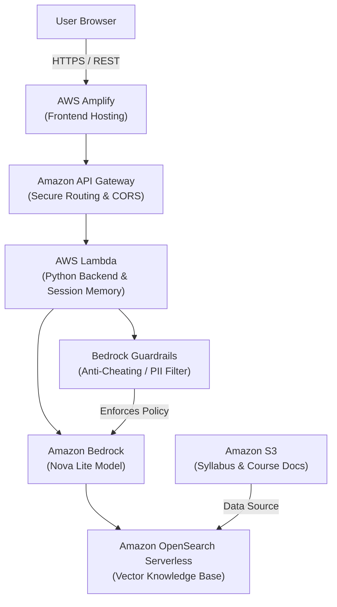

# 🎓 T.A.W.S. (Teaching Assistant With Safeguards)

**An AWS-powered AI teaching assistant that guides students without giving away the answers.** 

## 🌐 Live Demo
Experience the T.A.W.S. platform live right now! No installation required.
👉 **[Try the Live Web App Here](https://main.d3sxd2mzkjp4np.amplifyapp.com/)**

---

## 🚀 The Problem
The theme of AWSHacks 2026 is "Build with Gratitude." As students at the University of Washington , we wanted to use this opportunity to give back to the educators and mentors who have shaped our academic and professional journeys.  We are deeply grateful for the guidance of mentors such as Dr. Loveless, Dr. Richard Li, Isaiah Siegl, and Ting Gong. Their dedication to teaching and research inspired us to build a tool that supports the very mission they lead every day. Currently, the rise of generative AI has placed professors in a difficult position where they must act as "plagiarism police" rather than mentors. T.A.W.S. is our way of saying thank you—by providing a tool that handles 24/7 student support while fiercely protecting the academic integrity of their courses.  

## 💡 The Solution
**T.A.W.S.** is a specialized AI teaching assistant engineered specifically for academic integrity. Utilizing strict **Amazon Bedrock Guardrails** and specialized system prompting, T.A.W.S. actively refuses to do the work for the student. Instead of giving direct answers, it provides Socratic guidance, breaks problems down into manageable steps, and roots its explanations *strictly* in the professor's uploaded syllabus and course materials.

---

## ☁️ Serverless AWS Architecture

T.A.W.S. is powered by a fully serverless, event-driven AWS architecture designed for high scalability, low latency, and strict educational integrity.

### **1. AI & Orchestration (Amazon Bedrock)**
* **Foundation Model:** Powered by **Amazon Nova Lite**, a highly efficient, fast, and capable model perfectly suited for text-based educational reasoning, scaffolding, and logical deduction.
* **Knowledge Bases (RAG):** Uses Retrieval-Augmented Generation to ground the AI in factual course data. Documents are vectorized using an embedding model and stored in **Amazon OpenSearch Serverless** (the high-performance vector database driving the Knowledge Base).
* **Bedrock Agents:** Utilizes the ReAct (Reason and Action) framework to process student queries, intelligently deciding when to query the OpenSearch vector database for syllabus logistics versus when to rely on general domain knowledge.
* **Bedrock Guardrails:** Implements uncompromising content filters. Custom blocked-topic lists prevent the delegation of coursework (e.g., "write my code", "solve this equation") and mask Personally Identifiable Information (PII).

### **2. Backend Compute (AWS Lambda & API Gateway)**
* **Amazon API Gateway:** Acts as the secure front door to the backend pipeline. Configured as a REST API with strict CORS policies to ensure secure browser-to-cloud communication.
* **AWS Lambda:** A lightweight, serverless Python 3.12 backend handler. It manages session persistence (Session IDs) so the AI remembers conversation context, bridges the frontend with the Bedrock Agent Runtime, and streams responses back to the user.

### **3. Storage & Hosting (S3 & Amplify)**
* **Amazon S3 (Simple Storage Service):** Serves as the secure document repository (`taws-course-material-storage`), holding the flattened course syllabi, lecture slides, and reference PDFs that get ingested into OpenSearch.
* **AWS Amplify:** Hosts the React/Vite frontend web application, providing lightning-fast global content delivery (CDN) and automatic SSL (HTTPS) encryption.

### **4. Security (IAM)**
* **AWS IAM (Identity and Access Management):** Enforces the principle of least privilege across the application. Custom execution roles ensure Lambda can only invoke specific Bedrock Agents, and Bedrock can only read from authorized S3 buckets.

---

## 🔄 How the Data Flows
1. **User Input:** A student asks a question via the React UI hosted on AWS Amplify.
2. **API Request:** The request (along with a unique `sessionId` for memory) is sent via HTTPS to API Gateway.
3. **Lambda Execution:** API Gateway triggers a Python Lambda function, which formats the payload and invokes the Bedrock Agent.
4. **Guardrail Check (Pre-Processing):** Bedrock intercepts the prompt. If the student asks for direct answers or attempts to jailbreak the bot, the Guardrail blocks it immediately.
5. **Knowledge Retrieval:** The Bedrock Agent checks **OpenSearch Serverless** to find relevant chunks of the professor's uploaded PDFs in S3.
6. **Generation:** **Amazon Nova Lite** formulates an encouraging, Socratic response based *only* on the retrieved context.
7. **Delivery:** The response is streamed back through Lambda and API Gateway to the student's screen in seconds.

---

## ✨ Key Features
* **Strict Contextual Grounding:** If a course policy or deadline isn't covered in the S3 syllabus, the AI is programmed to admit it doesn't know, rather than hallucinating an answer.
* **Anti-Cheating Guardrails:** Plain-English and programmatic rules actively intercept and block the generation of direct homework solutions.
* **The Socratic Loop:** The AI is engineered with a pedagogical framework that forces it to end responses with an open-ended question, keeping the student actively engaged in problem-solving.
* **Stateful Session Memory:** Tracks conversation history natively so students can ask follow-up questions without having to re-explain their context.
* **Zero-Maintenance Infrastructure:** 100% serverless. No EC2 instances to patch, no databases to provision, and scales automatically from 1 to 10,000 students instantly.

---

## 👨‍💻 Created by
**Yidan (Adelin) Ma**  
🌐 [Personal Website](https://yd025.github.io/) | 🐙 [GitHub Profile](https://github.com/Yd025)

**Oscar Shijie Song**  
🌐 [Personal Website](https://oscariano.github.io/) | 🐙 [GitHub Profile](https://github.com/oscariano)